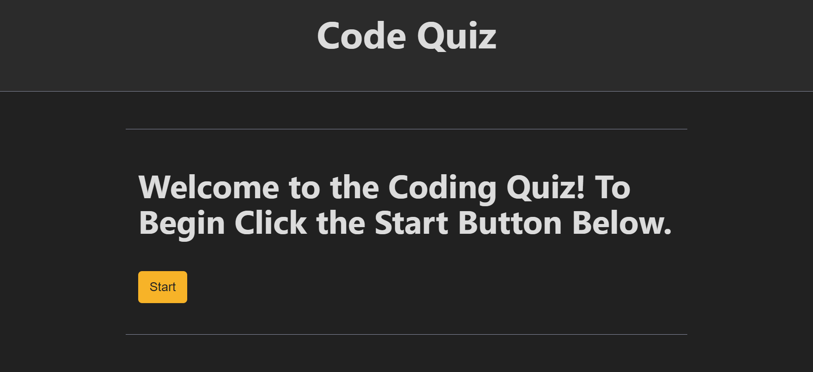

# code-quiz

[Link to my project :https://elijahnance.github.io/code-quiz/](https://elijahnance.github.io/code-quiz/)

## Table of Contents
- [Description]
- [Visuals]

## Description
This is a coding quiz built with JavaScript. It is designed for coding students to practice basic JavaScript. To begin the quiz you press start. A timer begins and you have 60 seconds to answer four questions. Each time an answer is incorrect the timer goes down 5 seconds. After you've answered the questions you recieve youre score and you can enter your initials to see how you match up with other users.

## Visuals
